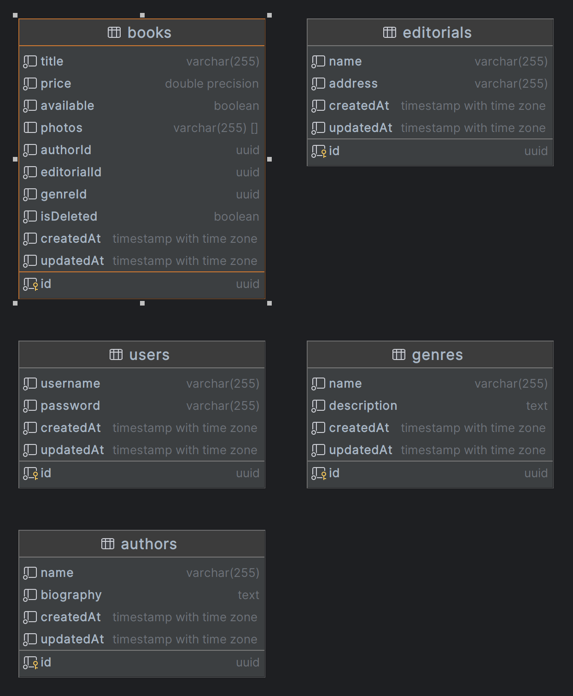

# CMPC Books

CMPC Books es una aplicación diseñada para la gestión de libros, autores, editoriales y géneros. Está construida utilizando una arquitectura hexagonal para garantizar la separación de responsabilidades y facilitar la escalabilidad y el mantenimiento del proyecto.

---

## Tecnologías utilizadas

- **Node.js**: Versión 20, para ejecutar el backend.
- **NestJS**: Framework para construir aplicaciones escalables y modulares en Node.js.
- **PostgreSQL**: Base de datos relacional para almacenar la información.
- **Sequelize**: ORM para interactuar con la base de datos PostgreSQL.
- **Zod**: Biblioteca para validación de esquemas.
- **Swagger**: Para la documentación de la API.
- **Docker**: Para contenerizar la aplicación y la base de datos.
- **JWT (JSON Web Tokens)**: Para la autenticación y autorización.
- **TypeScript**: Lenguaje principal del proyecto.

---

## Arquitectura hexagonal

La arquitectura hexagonal, también conocida como **Ports and Adapters**, organiza el código en capas para separar las responsabilidades y facilitar el mantenimiento. En este proyecto, las capas principales son:

1. **Dominio**:

   - Contiene las entidades principales del negocio, como `Book`, `Author`, etc.
   - Define las reglas de negocio y las interfaces de los repositorios.

2. **Aplicación**:

   - Contiene los casos de uso (por ejemplo, `BookCreator`, `BookSearch`, etc.).
   - Implementa la lógica de aplicación que interactúa con el dominio.

3. **Infraestructura**:

   - Contiene las implementaciones de los repositorios (por ejemplo, `BookRepositorySequelize`).
   - Maneja la interacción con la base de datos y otros servicios externos.

4. **Entradas y salidas**:
   - **Entradas**: Controladores que exponen la API REST (por ejemplo, `BookController`).
   - **Salidas**: Adaptadores para interactuar con la base de datos o servicios externos.

---

## Datos iniciales

La aplicación incluye un método llamado `populateInitialData` que se utiliza para insertar datos iniciales en la base de datos, como usuarios, autores, géneros, etc. Este método se encuentra en el archivo `database.providers.ts` y se ejecuta automáticamente al iniciar la aplicación.

### Uso en desarrollo

En entornos de desarrollo, este método es útil para poblar la base de datos con datos de prueba. Por defecto, está habilitado en el archivo `database.providers.ts`:

```typescript
await populateInitialData()
```

### Uso en producción

En entornos de producción, **se recomienda comentar o eliminar esta línea** para evitar que se inserten datos de prueba en la base de datos:

```typescript
/* await populateInitialData(); */
```

Esto asegura que la base de datos no se sobrescriba o contenga datos no deseados en producción.

---

## Comandos de `npm`

### Instalar dependencias

```bash
npm install
```

### Ejecutar en modo desarrollo

```bash
npm run start:dev
```

### Ejecutar en modo producción

1. Compilar el proyecto:
   ```bash
   npm run build
   ```
2. Ejecutar el proyecto:
   ```bash
   npm run start:prod
   ```

### Ejecutar pruebas

```bash
npm run test
```

---

## Comandos de `docker-compose`

### Levantar los servicios

```bash
docker-compose up --build
```

Esto levantará:

- Un contenedor para PostgreSQL.
- Un contenedor para la aplicación NestJS.

### Detener los servicios

```bash
docker-compose down
```

### Verificar los contenedores en ejecución

```bash
docker ps
```

---

## Configuración de la base de datos

La conexión a la base de datos PostgreSQL se configura en el archivo `database.providers.ts`. Es importante asegurarse de que los valores de configuración sean correctos para el entorno en el que se ejecuta la aplicación.

### Configuración en `database.providers.ts`

En el archivo `database.providers.ts`, los valores de conexión se definen en la instancia de Sequelize:

```typescript
const sequelize = new Sequelize({
  dialect: 'postgres',
  host: 'postgres', // Cambiar a 'localhost' si se usa el host local
  port: 5432, // Puerto de PostgreSQL
  username: 'admin', // Usuario de la base de datos
  password: 'admin', // Contraseña de la base de datos
  database: 'cmpc_books' // Nombre de la base de datos
})
```

## Acceso a la aplicación

- **API**: Disponible en `http://localhost:4000`.
- **Swagger**: Documentación de la API disponible en `http://localhost:4000/api`.

---

---

## Diagrama de la base de datos

A continuación se muestra el diagrama de las tablas relacionadas en la base de datos:



---
